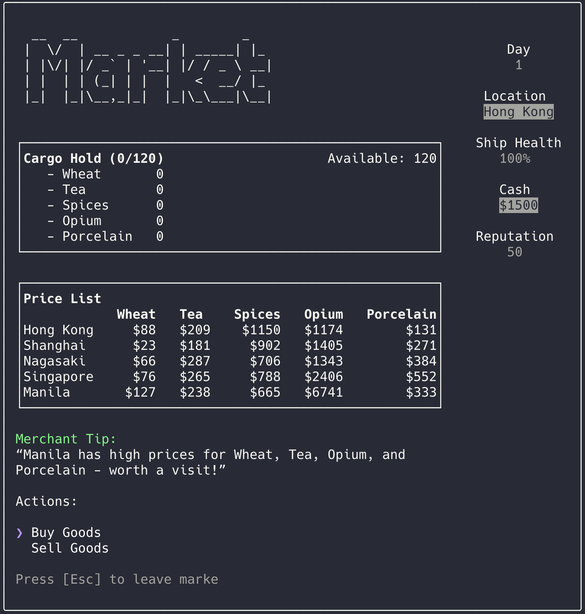

<pre style="color:green;background:transparent">
███████ ███████  █████      ████████ ██████   █████  ██████  ███████ ██████  
██      ██      ██   ██        ██    ██   ██ ██   ██ ██   ██ ██      ██   ██ 
███████ █████   ███████        ██    ██████  ███████ ██   ██ █████   ██████  
     ██ ██      ██   ██        ██    ██   ██ ██   ██ ██   ██ ██      ██   ██ 
███████ ███████ ██   ██        ██    ██   ██ ██   ██ ██████  ███████ ██   ██ 
</pre>



<br />

[](https://github.com/zyishai/sea-trader/releases)

[](https://github.com/zyishai/sea-trader/blob/main/LICENSE)

# 🚢 Set Sail in the Age of Trade
> The year is 1850. You're a merchant captain with a small ship, 1500 silver dollars, and dreams of building a trading empire.

Your mission? Turn your modest vessel into a trading empire during a 200-day voyage through historic ports of Hong Kong, Shanghai, Nagasaki, Singapore, and Manila.

## ⚡ Quick Start
Ready to hit the high seas? No installation needed:
```bash
$ npx ctrader
```
> Runs smoothly on iTerm (3.5.10+) and Warp (2024.11.21+)

<!-- [IMAGE: GIF showing quick gameplay loop - sailing, trading, encountering events] -->

## 🎮 Core Features

<details>
<summary>🌊 Trade & Economy</summary>

- Dynamic market system with realistic price fluctuations
- Strategic trading between 5 major Asian ports
- Port specialization and local production
- Three levels of market intelligence
- Merchant tips based on crew reputation
- Risk vs reward decisions with cargo space management
- Historically accurate cargo overloading mechanics
</details>

<details>
<summary>⚔️ Naval Combat & Protection</summary>

- Hire and manage your guard fleet
- Real-time damage distribution between your ship and guards
- Strategic fleet maintenance decisions
- Intense pirate encounters with multiple outcomes
</details>

<details>
<summary>⚓ Ship Management</summary>

- Historically accurate sailing speeds (8-20 knots)
- Strategic overloading decisions with risk/reward tradeoffs
- Critical decisions about repairs and upgrades
- Weather and damage affect your travel time
- Three upgrade types: Speed, Defense, and Capacity
</details>

<details>
<summary>🎲 Events & Encounters</summary>

- No two voyages are the same
- Random events that scale with your wealth
- Dynamic weather conditions
- Trade regulations that can make or break your fortune
- Mysterious islands with valuable cargo
</details>

## 🎯 Game Modes
- **Classic Mode**: 200 days to build your trading empire
- **Extended Mode**: Push beyond limits (with score penalties)

## 💡 Pro Tips
- Guard ships aren't just for show - they'll take most of the damage in fights
- Damaged ships sail slower - keep an eye on that repair cost
- Each port has its specialty goods - learn the trade routes
- Weather the market storms - sometimes holding cargo pays off
- Strategic overloading can be profitable, but watch the weather!
- Your reputation affects everything from prices to pirate encounters
- Consider ship upgrades based on your trading strategy:
     - Speed upgrades for longer routes
     - Defense upgrades for dangerous waters
     - Capacity upgrades for bulk trading

## 🏆 Scoring System
✅ Points are awarded for:  
- Accumulated wealth (cash + cargo value)
- Ship improvements (speed & capacity)
- Crew reputation

❌ Points are deducted for:
- Ship damage
- Extended game penalties
- Poor reputation

<!-- [IMAGE: Screenshot of end-game achievements with player's trading empire stats] -->

## 📜 Historical Notes
> Set in the bustling trade routes of 1850s Far East, *Sea Trader* uses authentic
period measurements and trading practices.

### ⚖️ Weight Measurement
All cargo is measured in **piculs (擔)**, the standard unit of maritime trade in 19th century Asia. One picul, approximately 60kg or 133lbs, was originally defined as "a man's load" - what a single porter could carry.

### 🚢 Storage System
Ships' storage capacity was measured in **"tons burden (t bm)"** - a volume-based measurement where different goods required different amounts of space.  

Sea Trader reflects this historical system through a simplified storage mechanism:  
- **Cargo Types**: Different goods require varying storage space
     - **Compact Goods** (like porcelain): Dense cargo that stores efficiently
     - **Standard Goods** (like wheat): Takes normal storage space
     - **Bulky Goods** (like tea): Requires extra storage space due to packaging and careful stowage
- **Overloading**: Ships can be loaded beyond their rated capacity
     - Reduces sailing speed proportionally to overload amount
     - Increases risk of cargo damage during storms
     - Makes escaping from pirates more difficult

### 💰 Currency
Prices in the game are in **Spanish silver dollars ($)**, the standard currency of Far East trade in the 1850s. Also known as "pieces of eight", these silver coins were accepted across all major ports from Hong Kong to Manila.

## 🚀 What's Coming Next
> These features are in active development!

- Banking and warehouses system
- Reputation-based trading advantages
- Port-specific events and quests
- New ports to explore with unique opportunities


## 🤝 Join the Crew
Love *Sea Trader*? Got ideas? We'd love to hear them! Open an issue for:
- New feature suggestions
- Balance tweaks
- Bug reports
- Historical accuracy improvements

## 📜 License
MIT - Feel free to fork and create your own trading adventure!

---
*"In these waters, fortune favors the bold... and the clever!"* 🏴‍☠️
