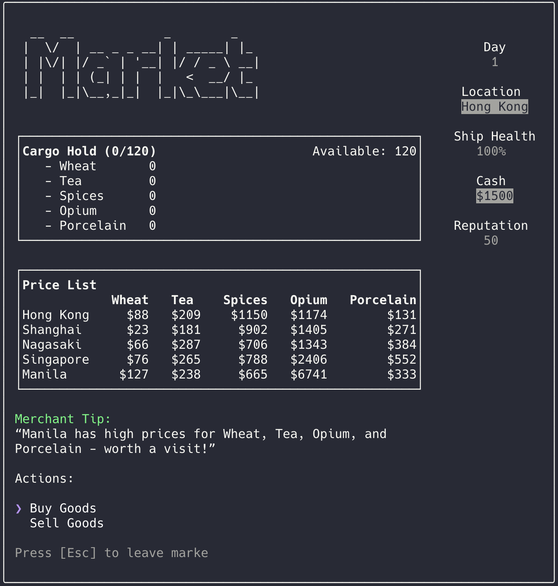

<pre style="color:green;background:transparent">
███████ ███████  █████      ████████ ██████   █████  ██████  ███████ ██████  
██      ██      ██   ██        ██    ██   ██ ██   ██ ██   ██ ██      ██   ██ 
███████ █████   ███████        ██    ██████  ███████ ██   ██ █████   ██████  
     ██ ██      ██   ██        ██    ██   ██ ██   ██ ██   ██ ██      ██   ██ 
███████ ███████ ██   ██        ██    ██   ██ ██   ██ ██████  ███████ ██   ██ 
</pre>

<br />



<br />

[](https://github.com/zyishai/sea-trader/releases)

[](https://github.com/zyishai/sea-trader/blob/main/LICENSE)

# 🚢 Overview
*Sea Trader* is a terminal-based trading simulation set in 19th century East Asia. As a maritime merchant, you'll navigate the South China Sea during a 200-day voyage. Trade exotic goods between bustling ports, fight off pirates, and master the ever-changing markets to maximize your wealth!

# ⚡️ Quick Start
Run the game directly with:
```bash
$ npx ctrader
```

## Requirements
- **Node.js** 18 or newer.
- **Terminal**: any modern terminal with Unicode and color support, on macOS, Linux, or Windows. On Windows, use Windows Terminal.
- **Window size**: at least 60×20 characters. At 80×32 or larger, every game screen fits without scrolling.

If a screen doesn't fit, scroll with the mouse wheel or PgUp/PgDn (Fn+↑/↓ on Mac laptops). While a screen can scroll, hold Shift (Option on macOS) to select text with the mouse. If the window is below the minimum size, enlarge it or zoom out.

# 🎮 Core Features
- Trade between 5 major ports: Hong Kong, Shanghai, Nagasaki, Singapore, and Manila
- Deal in period-accurate goods: Wheat, Tea, Spices, Opium, and Porcelain
- Gather market intelligence from local merchants
- Upgrade your ship to sail faster and maximize hold's capacity
- Protect your cargo with hired guard ships
- Fight off pirates and loot their treasures
- Navigate through storms and various maritime events

# 💡 Game Strategy Tips
Here are some tips to kickstart your strategy:
- Seasons change every 30 days, affecting prices and event probabilities.
- Increase your reputation by defeating pirates and upgrading your ship. Higher reputation provides better market intelligence and reduces pirate attacks.
- You can overload your ship's hold but doing so slows you down and increases the chances for certain events.
- Monitor your ship's health - you won't be able to sail if your ship is greatly damaged! Also, it'll hurt your final score at the end of the game.
- Guard ships absorb damage during combat but require a daily maintenance fee.

# 🤝 Contribution
The game's core mechanics are under active development, but we welcome:
- Feature suggestions
- Game balance feedback
- Bug reports
- Historical accuracy improvements

# 📜 License
MIT - This is an Open Source game! 💪
